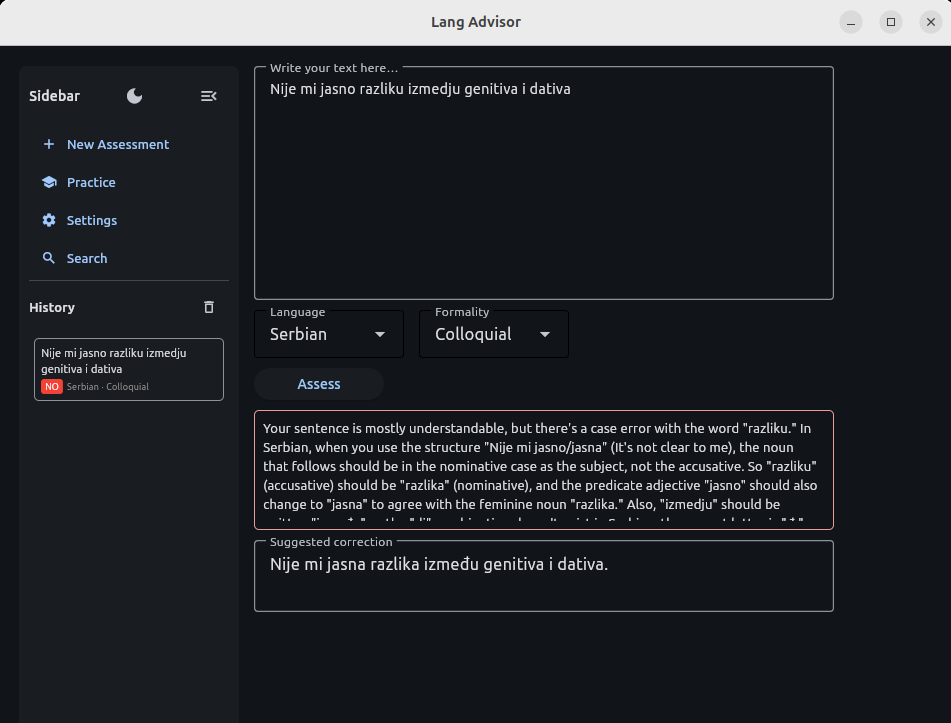
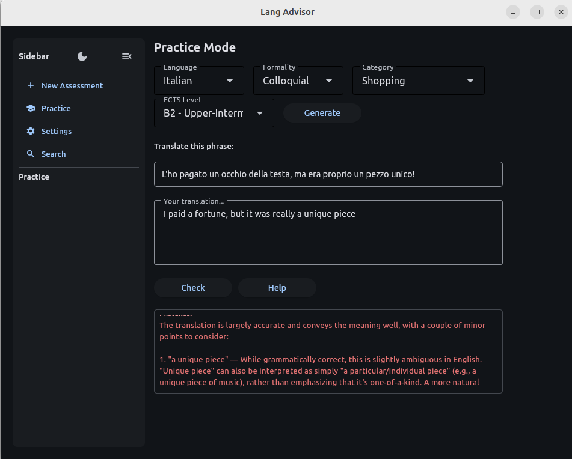
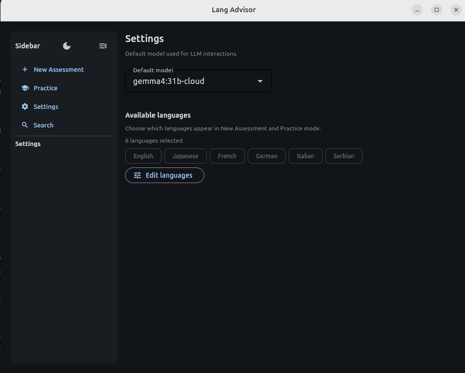

# LangAdvisor

A Flet GUI application for grammar assessment and language practice, using local LLMs via [Ollama](https://docs.ollama.com/), or cloud
LLMs via [Ollama Cloud](https://docs.ollama.com/cloud) service. Free-tier cloud LLMs work well. 

## Features

Self-conscious about mistakes you might be making in messages or emails? You can quickly submit your message for an assessment of its correctness and intelligibility by a native speaker:



Want some interactive practice, suited to your level and a topic of interest? You can generate phrases and have your translations graded:



Virtually any major language is supported, and you can decide which Ollama model you wish to use depending on your desire for local execution, speed or accuracy:



## Prerequisites

- Python 3.10+
- [uv](https://docs.astral.sh/uv/getting-started/installation/) 
- [Ollama](https://ollama.com/) running locally with a model available (e.g. `ollama pull llama3.2`)

## Running

You can download pre-built desktop apps for Windows and Linux in the Releases pane if you don't want to clone the source.

It's also quite easy to run from source if you have `uv` installed. Simply clone the source code and run: 

   
```bash
   uv run main.py
```

`uv` will automatically create a local virtual environment and pull down needed dependencies.

### As a webserver

If you have a server where you'd like to host the app for multiple users to access over the web, it's as simple as:

```bash
FLET_FORCE_WEB_SERVER=true FLET_SERVER_PORT=8008 uv run main.py
```

Then the app will be available on http://myserver:8008/ . Ensure you have ollama running wherever you are running this from.
A raspberry pi or equivalent works well if you are routing requests to Ollama Cloud and want to make this available to devices
in your local network.